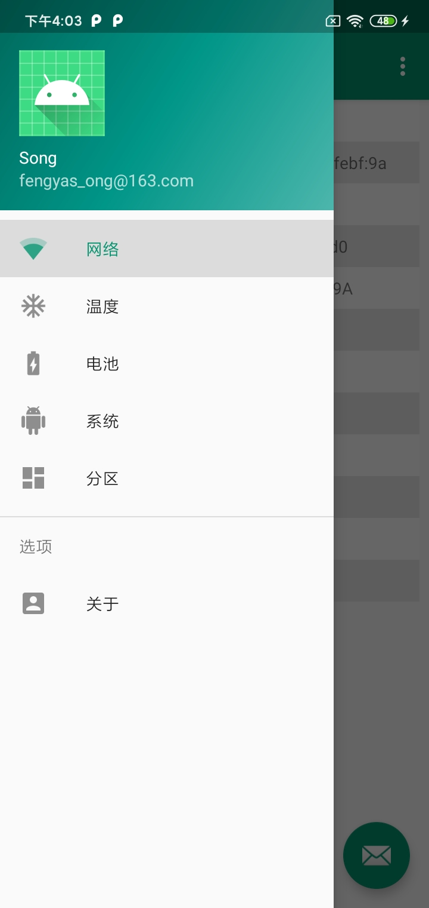
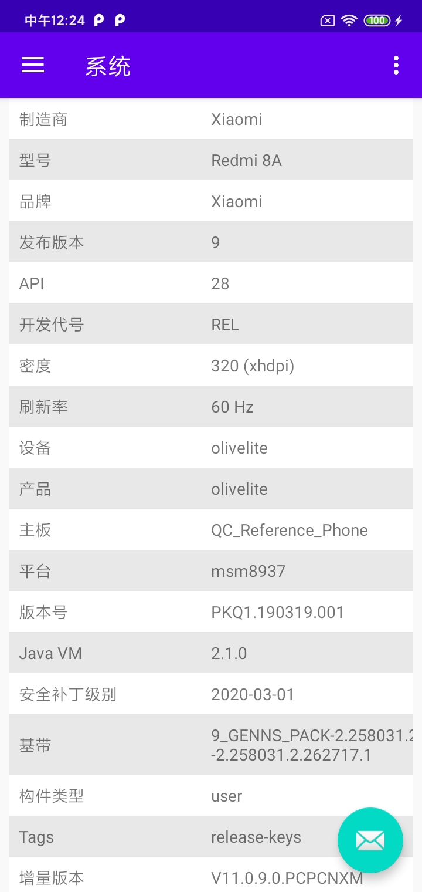
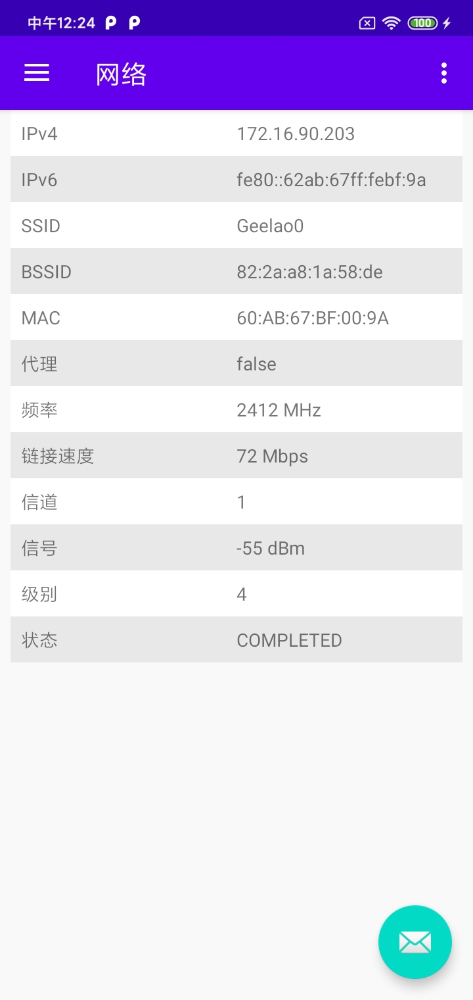
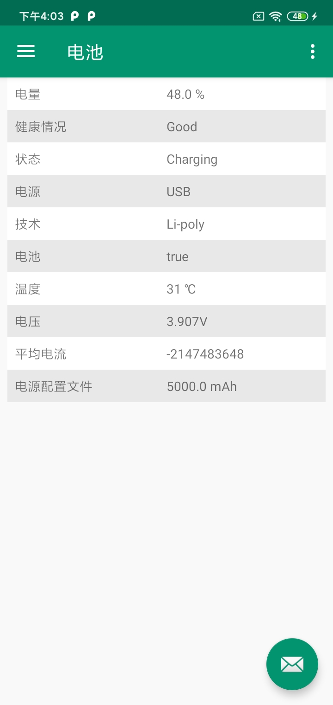

## 设备信息

**获取 `Android` 设备信息**

## 截图

## ChangeLog

版本 | 更新内容 | 更新日期
-----|-----|-----
**0.1.2** | 1、新增电池信息采集模块； 2、新增系统信息采集模块 | 2020-05-28
**0.1.1** | 1、新增温度信息采集模块 | 2020-05-27
**0.1.0** | 1、搭建整体框架； 2、新增网络信息采集模块 | 2020-05-26