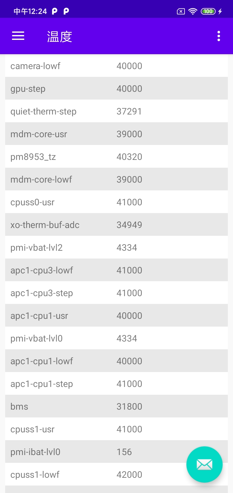

## 设备信息

**获取 `Android` 设备信息采集**

## 信息采集模块
- 网络信息
- 电池信息
- 温度监控信息
- 系统参数信息
- 分区文件信息
- 内存信息
- 应用程序信息
- 输出驱动信息采集

> 后续还会不断添加

## 截图

## ChangeLog

版本 | 更新内容 | 更新日期
-----|-----|-----
**0.1.7** | 1、输出驱动信息采集； | 2020-06-05
**0.1.6** | 1、编解码器信息采集； | 2020-06-03
**0.1.5** | 1、应用程序信息采集； | 2020-06-03
**0.1.4** | 1、内存信息采集； | 2020-06-02
**0.1.3** | 1、分区文件信息采集； | 2020-06-01
**0.1.2** | 1、新增电池信息采集模块； 2、新增系统信息采集模块 | 2020-05-28
**0.1.1** | 1、新增温度信息采集模块 | 2020-05-27
**0.1.0** | 1、搭建整体框架； 2、新增网络信息采集模块 | 2020-05-26